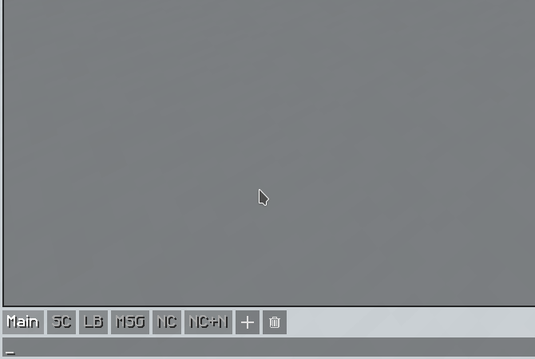

# Embellish

## About
Embellish is a Spigot plugin to generate colour codes for string ingame. This allows players to quickly apply and preview hexadecimal colour codes to signs, their nickname or other things that take hex codes. Embellish is made for servers Minecraft 1.16 and above! Hex code support was only introduced in Minecraft 1.16, so this is required.  
This plugin doesn't handle setting nicknames itself, but you can configure a button which allows players to easily set it from this plugin.  

## Showcase


### Permissions
- `embellish.help` - Show the help message  
- `embellish.reload` - Reload the plugin config  
- `embellish.use.solid` - Set a solid colour  
- `embellish.use.gradient` - Set a gradient  
- `embellish.use.pattern` - Use main pattern command  
- `embellish.use.pattern.stretch` - Use the stretch pattern  
- `embellish.use.pattern.repeat` - Use the repeat pattern  
- `embellish.use.pattern.gradient` - Use the gradient pattern  
- `embellish.use.preset` - Use presets  
- `embellish.use.preview` - Just use the command to preview existing colours  
- `embellish.listpresets` - List all presets  

### Configuration
The default configuration of the plugin is:  
```yaml
# Config file for Embellish. This defines presets and defaults

# The command to use to set nicknames with a button
# Leave blank to disable: ""
nick-command: "/nick"

# This determines what the plugin detects as a nickname and shows the command button for
nick-length: 20

presets:
  rgb:
    type: repeat
    colours:
    - red
    - green
    - blue
  transpride:
    type: gradient
    colours:
    - aqua
    - pink
    - white
    - pink
    - aqua
  rainbow:
    type: stretch
    colours:
    - red
    - orange
    - yellow
    - green
    - blue
    - purple
```
For presets, at least one colour needs to be defined. And the type needs to be one of `repeat`, `gradient` or stretch`.  
The configuration file can be reloaded by running `/embellish reload`!  
With `nick-command`, a player can set the result as a nickname by pressing a button if it doesn't contain spaces and the length doesn't exceed `nick-length`.  